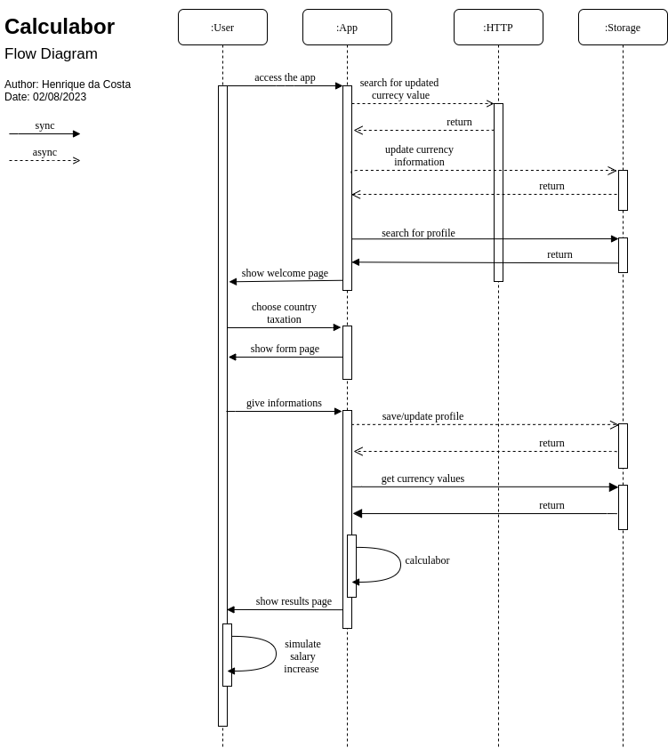

# Calculabor

Este aplicativo foi desenvolvido para facilitar o cálculo do valor do salário por hora, mês, dia e ano de forma simples e eficiente. Além disso, oferece recursos avançados para simulações de salário em diferentes moedas, como dólar e euro, e também permite simulações para regime de Pessoa Jurídica (PJ).

## Principais Recursos:

- Cálculo Preciso: Obtenha o valor do salário em diferentes períodos de tempo de maneira rápida e precisa.
- Conversão de Moeda: Simule seu salário em dólar, euro e outras moedas para avaliar seu valor em diferentes contextos econômicos.
- Simulação PJ: Compare valores de salários com base em regime de Pessoa Jurídica para tomar decisões mais informadas.
  Sinta-se à vontade para contribuir, abrir problemas ou sugerir melhorias para aprimorar essa ferramenta e torná-la ainda mais útil!

## Dev

- This project was built using the [esbenp.prettier-vscode](https://marketplace.visualstudio.com/items?itemName=esbenp.prettier-vscode) extension for properly formatting the code.

- For the CSS naming convention is used the BEM (Block Element Modifier), a popular naming convention that is designed to be modular and reusable. It consists of three parts: the block, the element, and the modifier. The block is the main component, the element is a part of the block, and the modifier is a variation of the element. For example, a button block might have an element called `.button__label` and a modifier called `.button__isActive`.

## Color Scheme

- #FFFFFF 
- #17C7FF 
- #A6A6A6 
- #C1FF72 
- #0a1e41 
- #334762 

#
